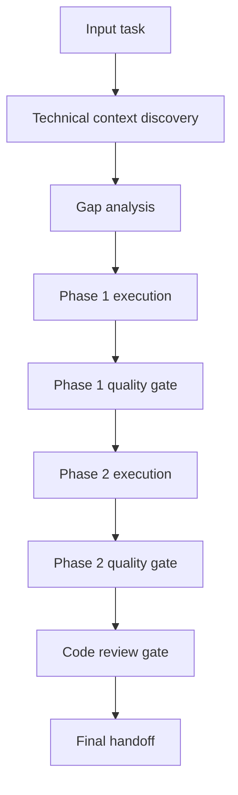

# <task-name> - Flow Artifact

## Flow Overview

This flow converts the scoped task into an executable sequence with explicit gates.

## Mermaid Flow

## Execution Checklist

### Phase 1 - Discovery and Scoping

- [ ] Confirm requirements and constraints
- [ ] Identify reusable components
- [ ] Define create/modify/reuse scope
- [ ] Pass phase quality gate

### Phase 2 - Implementation

- [ ] Execute scoped changes
- [ ] Verify behavior with relevant checks/tests
- [ ] Update docs impacted by implementation
- [ ] Pass phase quality gate

### Phase 3 - Review and Handoff

- [ ] Run review against requirements and plan
- [ ] Document findings and residual risks
- [ ] Confirm acceptance criteria completion
- [ ] Prepare concise handoff summary

## Decision Gates

| Gate | Check | Pass Condition |
|---|---|---|
| G1 | Scope completeness | All required items classified (create/modify/reuse) |
| G2 | Implementation quality | Relevant checks/tests pass or gaps documented |
| G3 | Review readiness | Findings resolved or explicitly accepted |

## Dependencies

- <dependency 1>
- <dependency 2>

## Exit Criteria

- [ ] Docs artifact and flow artifact are consistent
- [ ] All mandatory phases are represented
- [ ] Quality gates are explicit and testable
